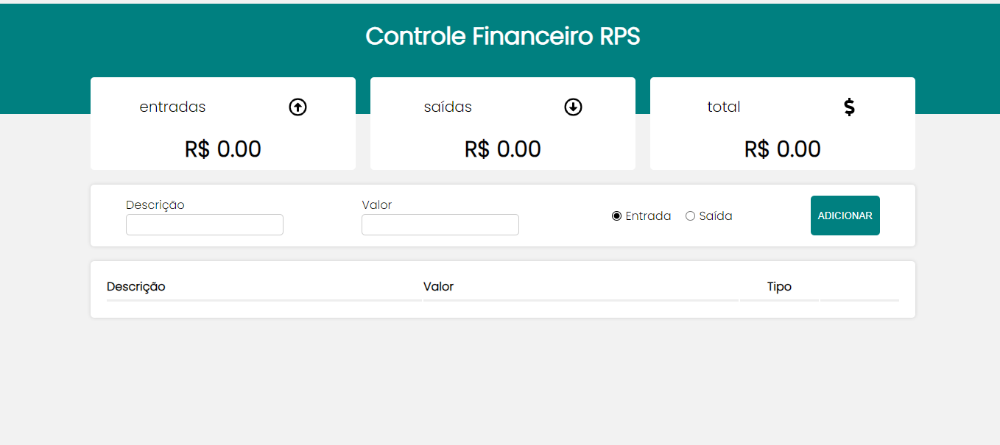

<h1 align="center"> Controle de Finanças </h1>

Programa exclusivo para manter o controle da sua empresa.  

  <a href="#-tecnologias">Tecnologias</a>&nbsp;&nbsp;&nbsp;|&nbsp;&nbsp;&nbsp;
  <a href="#-projeto">Projeto</a>&nbsp;&nbsp;&nbsp;|&nbsp;&nbsp;&nbsp;
  <a href="#-layout">Layout</a>&nbsp;&nbsp;&nbsp;|&nbsp;&nbsp;&nbsp;
  <a href="#memo-licença">Licença</a>

  

 

  

## 🚀 Tecnologias

Esse projeto foi desenvolvido com as seguintes tecnologias:

- HTML e CSS
- JavaScript
- Git e Github

## 💻 Projeto

O projeto de controle financeiro web foi desenvolvido exclusivamente para atender às necessidades da empresa RPS AUTO PEÇAS, permitindo um controle eficiente de produtos e finanças ao longo do dia. Com essa solução, a empresa poderá gerenciar de forma mais organizada suas operações, acompanhar o estoque de produtos e monitorar as movimentações financeiras de forma prática e acessível.

- [Visite o projeto online](https://controle-financeiro-rpsauto.vercel.app/
)

## :memo: Licença

Esse projeto está sob a licença MIT.

---# financial.control
#finance.control
